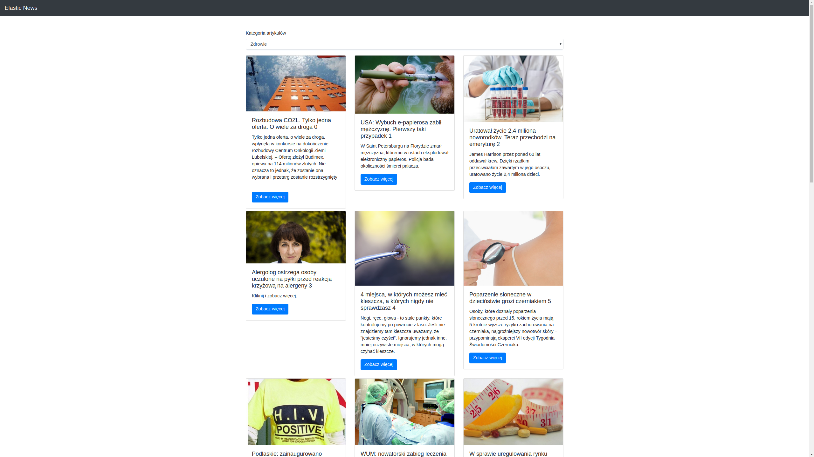

# elastic-news
Wyszukiwanie aktualnych informacjii z kraju po kategoriach.

### Technologie
- Java 8
- Java EE
- React
- Webpack
- MVN
- RestEasy
- JUnit / Mockito
- Guava
- Git
- Wildfly

**API do pobierania wiadomości  https://newsapi.org/**

### Instalacja

Elastic News wymagania:
- System Operacyjny zalecany Linux
- Java 8
- NPM
- Wildfly 12
- MVN

Instrukcja przygotowana jest pod systemem Linux, aby odpalić aplikację pod Windows należy dostosować komendy pod bash.

**Instlacja/Uruchomienie Wildfly 12**
Pobierz przygotowanego Wildfly'a z:
https://drive.google.com/file/d/1AjO8DXsxqy1rsuHXTopr7wp5Ou7uX9zZ/view?usp=sharing

Uruchomienie Wildfly
```sh
cd wildfly-12/bin
./standalone.sh -c standalone-full.xml
```
Użytkownik Wildfly:
```sh
login: elastic-news
password: q1w2e3r4
```

**Przygotowany serwer ma zainstalowaną aktualną aplikacje elastic-news**

##### Adres aplikacji po uruchomieniu serwera:
##### http://localhost:8080/elastic-news/index.html


### Budowanie projektu
W projekcie pod system linux przygotowano skrypt budujący i wgrywający projekt na odpalonego wildfly
Uruchomienie skryptu:
```sh
./deploy.sh 
```
Skrypt ten buduje wszystkie moduły mavenowe w projekcie, i projekt webowy za pomocą webpack/npm.

### Moduły
- api - moduł w którym znajdują się wszystkie interfejsy REST, oraz encje wykorzystywane w endpointach
- integration - serwisy pobierające informacje z https://newsapi.org/
- web - backend i front aplikacji elastic-news
- common - klasy pomocnicze


### Zrzuty
##### Wybrana Kategoria Technologia


##### Wybrana Kategoria Zdrowie


##### Wybór Kategorii - Wybrana Zdrowie


